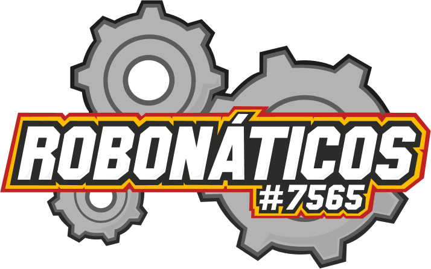

<p align="center">
  
  
  <p align="center">
  Web site made to share all about Robonáticos Robotics Team!
  </p>

</p>

<p align="center">
  

  

  

  <br>

  

  <a href="https://www.linkedin.com/company/robonaticos/">
    
  </a>
</p>

 
# Index

- :rocket: [Project Summary](#rocket-project-summary)
- 👨‍💻️ [Technologies Used](#%EF%B8%8F-technologies-used)
- 📦️ [How to install the project](#%EF%B8%8F-how-to-install-the-project)
- 🤔️ [How can you contribute?](#%EF%B8%8F-how-can-you-contribute)
 
## :rocket: Project Summary

This Project was made to share all about Robonáticos Robotics Team!

> Made by team students  
 
## 👨‍💻️ Technologies Used

This project was developed using the technologies bellow:
  
### Frontend

  - [React JS](https://reactjs.org/)
  - [Typescript](https://www.typescriptlang.org/)
  
### Dependencies

  - [React Router DOM](https://reacttraining.com/react-router/)
  - [React Icons](https://react-icons.github.io/react-icons/)
  - [Axios](https://github.com/axios/axios)

### IDE

  - [Visual Studio Code](https://code.visualstudio.com/)

---
 
## 📦️ How to install the project

To clone the project, use the commands bellow:

```bash
  # Clone the repository
  ❯ git clone https://github.com/Robonaticos7565/Website.git

  # Enter directory
  ❯ cd Website
```

### Frontend

To install dependencies and initialize the project, you can use **Yarn** or **NPM**:

**Using yarn**

```bash
  # Enter frontend directory
  > cd frontend

  # Install the dependencies
  ❯ yarn

  # Start the project
  ❯ yarn start
```

**Using npm**

*If you use NPM, delte `yarn.lock` file to see all installed dependencies in the best way.*

```bash
  # Enter frontend directory
  > cd frontend
  
  # Install the dependencies
  ❯ npm install

  # Start the project
  ❯ npm start
```
---
 
## 🤔️ How can you contribute?

1. `fork` this repository
2. Create a branch with your feature:
   - `$ git checkout -b my_feature`
3. Commit your branch:
   - `$ git commit -m "feature: My new feature"`
4. Submit your branch:
   - `$ git push origin my_feature`

---

# License
[MIT License](/LICENSE)

<h4 align="center">
  Made with :yellow_heart: by Robonáticos Team <a href="mailto:robonaticos7565@gmail.com">Get in touch!</a>
</h4>
